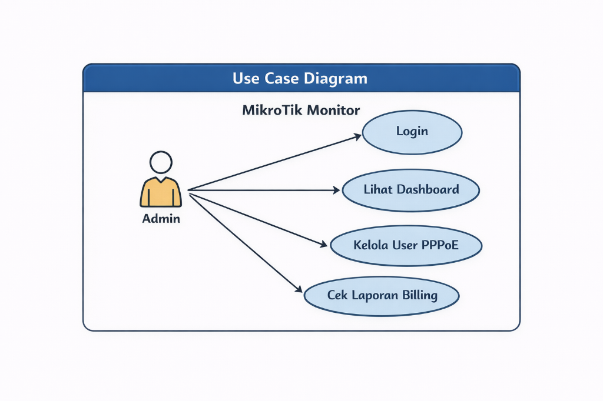
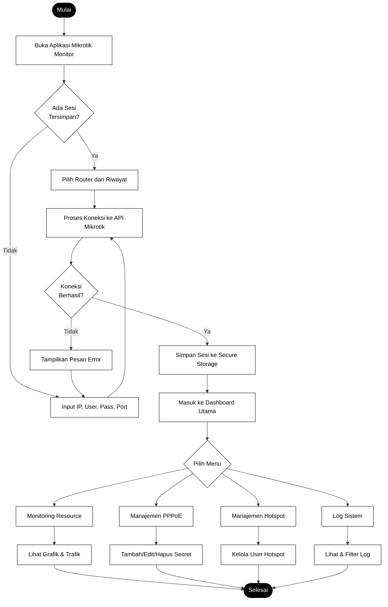
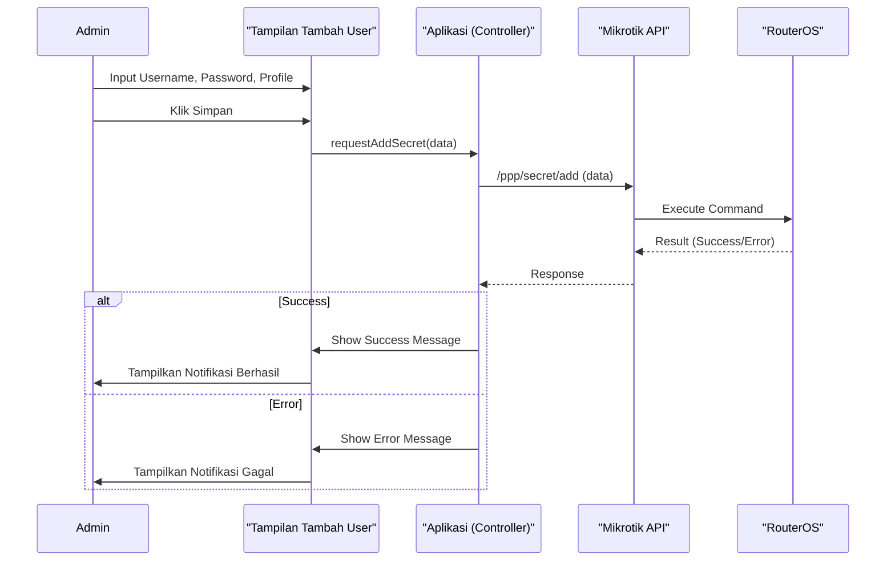
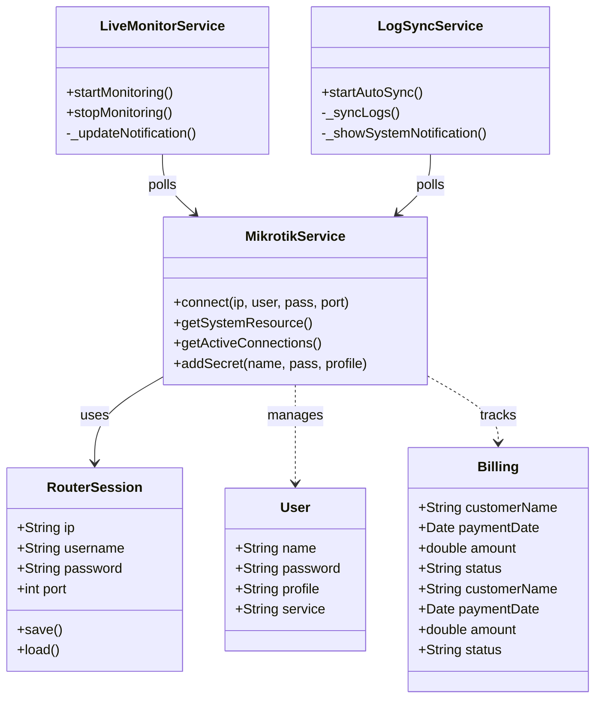

# Analisis dan Desain Sistem Perangkat Lunak: Mikrotik Monitor


## A. Latar Belakang Permasalahan

Dalam era digital saat ini, konektivitas internet menjadi kebutuhan primer. Penyedia jasa layanan internet (ISP) skala kecil hingga menengah, seperti RT/RW Net, seringkali mengandalkan perangkat Mikrotik sebagai router utama untuk manajemen bandwidth dan pengguna. Namun, manajemen perangkat Mikrotik secara tradisional seringkali mengharuskan administrator untuk menggunakan perangkat komputer (PC/Laptop) dengan aplikasi Winbox atau mengakses via web browser yang kurang responsif di perangkat mobile.

Permasalahan yang sering dihadapi adalah:

1.  **Keterbatasan Aksesibilitas:** Administrator sulit memantau kondisi jaringan secara _real-time_ ketika tidak berada di depan komputer.
2.  **Responsivitas Penanganan Masalah:** Keterlambatan dalam mendeteksi dan menangani gangguan jaringan karena tidak adanya notifikasi langsung ke perangkat pribadi.
3.  **Efisiensi Operasional:** Proses manajemen pelanggan (PPPoE/Hotspot) dan penagihan (billing) yang masih manual atau terpisah dari sistem monitoring.

Oleh karena itu, dibutuhkan sebuah solusi berupa aplikasi _mobile_ "Mikrotik Monitor" yang memungkinkan administrator untuk memantau, mengelola, dan menerima notifikasi terkait status jaringan Mikrotik kapan saja dan di mana saja melalui _smartphone_.

## B. Ruang Lingkup Proyek

Proyek ini mencakup pengembangan aplikasi _mobile_ berbasis Flutter yang terintegrasi dengan RouterOS Mikrotik melalui API.

**Batasan Masalah:**

1.  Aplikasi berjalan pada platform Android.
2.  Koneksi ke router menggunakan IP Public atau VPN (jika di luar jaringan lokal) dan IP Lokal (jika dalam jaringan).
3.  Fokus utama pada manajemen pengguna PPPoE, Hotspot, dan monitoring resource sistem.

**Fitur Utama:**

1.  **Dashboard Monitoring:** Menampilkan penggunaan CPU, Memory, Uptime, dan trafik antarmuka secara _real-time_.
2.  **Manajemen User (PPPoE & Hotspot):** Melihat, menambah, mengedit, dan menghapus data pengguna (Secret/Profile).
3.  **Billing Sederhana:** Pencatatan pembayaran pelanggan dan status tagihan.
4.  **Log Sistem:** Melihat log aktivitas router dan log aplikasi.
5.  **Notifikasi:** Pemberitahuan status jaringan atau aktivitas penting.
6.  **Manajemen ODP:** Pemetaan data Optical Distribution Point (ODP).

## C. Feasibility Analysis (Business Model Canvas)

Berikut adalah analisis kelayakan bisnis menggunakan Business Model Canvas (BMC):

| Komponen                   | Deskripsi                                                                                                                                                                                                             |
| :------------------------- | :-------------------------------------------------------------------------------------------------------------------------------------------------------------------------------------------------------------------- |
| **Key Partners**           | Komunitas Pengguna Mikrotik, Penyedia Layanan VPN/IP Public, Toko Perlengkapan Jaringan.                                                                                                                              |
| **Key Activities**         | Pengembangan Aplikasi (Coding), Maintenance & Update, Pemasaran Digital, Customer Support.                                                                                                                            |
| **Key Resources**          | Tim Developer (Flutter & Backend), Server Database (untuk backup/sync), Infrastruktur Testing (Router Mikrotik).                                                                                                      |
| **Value Propositions**     | **Monitoring Real-time:** Pantau jaringan dari mana saja.<br>**All-in-One Tool:** Manajemen user dan billing dalam satu aplikasi.<br>**User Friendly:** Antarmuka mobile yang intuitif dibanding WebFig/Winbox di HP. |
| **Customer Relationships** | Support via Telegram/WhatsApp, Tutorial penggunaan di YouTube, Update fitur berkala.                                                                                                                                  |
| **Channels**               | Google Play Store, Website Landing Page, Grup Komunitas RT/RW Net (Facebook/Telegram).                                                                                                                                |
| **Customer Segments**      | Pemilik RT/RW Net, Administrator Jaringan Sekolah/Kantor, Teknisi Jaringan Lepas.                                                                                                                                     |
| **Cost Structure**         | Biaya Server/Hosting, Biaya Developer, Biaya Pemasaran, Biaya Langganan API/Tools.                                                                                                                                    |
| **Revenue Streams**        | Penjualan Aplikasi (Paid App), Model Berlangganan (SaaS) untuk fitur Premium (Cloud Backup/Notif WA), Iklan (untuk versi Free).                                                                                       |

## D. Analisis Kebutuhan Fungsional

Berdasarkan ruang lingkup, berikut adalah kebutuhan fungsional sistem:

1.  **Autentikasi:**

    - Sistem harus dapat memvalidasi login menggunakan IP, Username, Password, dan Port API Mikrotik.
    - Sistem harus dapat menyimpan riwayat login (session) untuk kemudahan akses berikutnya.

2.  **Monitoring:**

    - Sistem harus menampilkan grafik penggunaan CPU dan Memory secara _live_.
    - Sistem harus menampilkan daftar antarmuka (interface) beserta trafik upload/download-nya.

3.  **Manajemen PPPoE:**

    - Sistem harus dapat menampilkan daftar _Active Connections_.
    - Sistem harus dapat menampilkan daftar _Secrets_ (akun pelanggan).
    - Sistem harus dapat menambah, mengubah, dan menghapus _Secret_.

4.  **Billing & Pelanggan:**

    - Sistem harus dapat mencatat data pelanggan dan status pembayaran bulanan.
    - Sistem harus dapat mengirimkan bukti tagihan (via share text/image).

5.  **Utilitas:**

    - Sistem harus menyediakan fitur _Reboot_ dan _Shutdown_ router.
    - Sistem harus dapat melakukan sinkronisasi database lokal dengan data router.

6.  **Background Services:**
    - **Live Monitor:** Service latar belakang yang memantau trafik dan resource setiap detik untuk notifikasi persisten.
    - **Log Sync:** Service latar belakang yang menyinkronkan log router ke server backend setiap 10 detik dan memicu notifikasi lokal untuk event kritis.

## E. Analisis Kebutuhan Non-Fungsional

1.  **Usability (Kemudahan Penggunaan):**

    - Antarmuka harus responsif dan mendukung mode Gelap/Terang (_Dark/Light Mode_).
    - Navigasi antar menu harus intuitif (maksimal 3 klik untuk fitur utama).

2.  **Performance (Kinerja):**

    - Waktu muat data _real-time_ tidak boleh lebih dari 2 detik pada koneksi stabil.
    - Aplikasi tidak boleh membebani CPU _smartphone_ secara berlebihan (baterai hemat).

3.  **Security (Keamanan):**

    - Password router harus disimpan secara terenkripsi di penyimpanan lokal perangkat (_Secure Storage_).
    - Komunikasi data sensitif tidak boleh di-log secara telanjang (plain text).

4.  **Compatibility (Kompatibilitas):**
    - Aplikasi harus berjalan lancar pada Android versi 8.0 ke atas.
    - Kompatibel dengan RouterOS v6 dan v7.

## F. Perancangan Sistem (UML)

### 1. Use Case Diagram



```mermaid
usecaseDiagram
    actor Admin as "Administrator Jaringan"

    package "Mikrotik Monitor App" {
        usecase "Login ke Router" as UC1
        usecase "Lihat Dashboard (Resource)" as UC2
        usecase "Kelola PPPoE Secret" as UC3
        usecase "Monitoring Traffic" as UC4
        usecase "Kelola Billing" as UC5
        usecase "Lihat Log Sistem" as UC6
    }

    Admin --> UC1
    UC1 --> UC2 : include
    Admin --> UC3
    Admin --> UC4
    Admin --> UC5
    Admin --> UC6
```

### 3. Alur Sistem yang Diusulkan (Gambar 3.3)

Berikut adalah diagram alur sistem yang menggambarkan proses utama dari awal membuka aplikasi hingga pengguna dapat menggunakan fitur-fitur yang tersedia.



**Penjelasan Alur Data:**

1.  **Inisialisasi:** Pengguna membuka aplikasi. Sistem memeriksa apakah ada data login (sesi) yang tersimpan sebelumnya di penyimpanan lokal (_SharedPreferences_).
2.  **Autentikasi:**
    - Jika ada sesi, pengguna memilih router yang ingin dipantau.
    - Jika tidak ada, pengguna memasukkan kredensial router (IP Address, Username, Password, Port API).
3.  **Koneksi:** Aplikasi mencoba membuat koneksi _socket_ ke router Mikrotik melalui API.
4.  **Validasi:**
    - Jika koneksi gagal (misal: IP salah atau timeout), pesan error ditampilkan dan pengguna diminta input ulang.
    - Jika berhasil, data sesi disimpan (jika baru) dan pengguna diarahkan ke Dashboard.
5.  **Operasional:** Di Dashboard, pengguna dapat mengakses berbagai fitur (Monitoring, PPPoE, Hotspot, Log). Setiap aksi (seperti menambah user PPPoE) akan mengirimkan _request_ API ke router dan menerima _response_ untuk ditampilkan kembali ke pengguna.

### 3. Sequence Diagram (Menambah Secret PPPoE)



### 4. Class Diagram



## G. Desain Antarmuka (UI/UX)

Desain antarmuka dirancang menggunakan pedoman **Material Design 3** untuk memastikan konsistensi dan estetika modern.

**Prinsip Desain:**

1.  **Clean & Minimalist:** Fokus pada data penting (angka trafik, status user) dengan mengurangi elemen visual yang tidak perlu.
2.  **Color Coding:** Menggunakan warna indikator yang jelas (Hijau = Online/Lunas, Merah = Offline/Belum Bayar, Kuning = Warning).
3.  **Responsive Typography:** Ukuran teks yang mudah dibaca pada berbagai ukuran layar _smartphone_.

**Struktur Menu (Sitemap):**

- **Login Screen:** Form input kredensial dengan latar belakang branding.
- **Dashboard:** Card ringkasan resource (CPU, Memory, HDD) dan grafik trafik live.
- **Menu Drawer:** Navigasi utama ke fitur-fitur lain (PPPoE, Hotspot, Logs, Settings).
- **List Screen (Secrets/Active):** Daftar item dengan fitur pencarian dan _Floating Action Button_ (FAB) untuk menambah data.
- **Detail/Form Screen:** Halaman input data dengan validasi form.

_(Implementasi nyata dapat dilihat pada kode program di folder `lib/screens/` seperti `dashboard_screen.dart`, `login_screen.dart`, dll.)_
