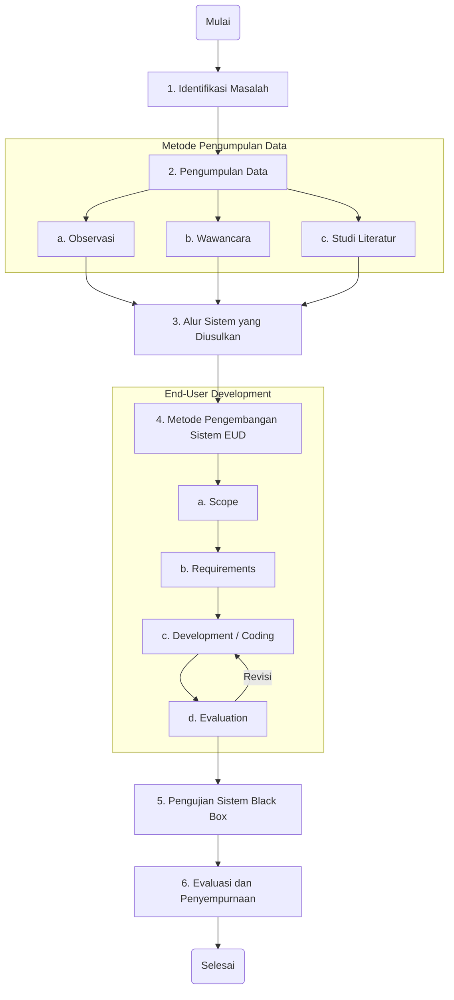
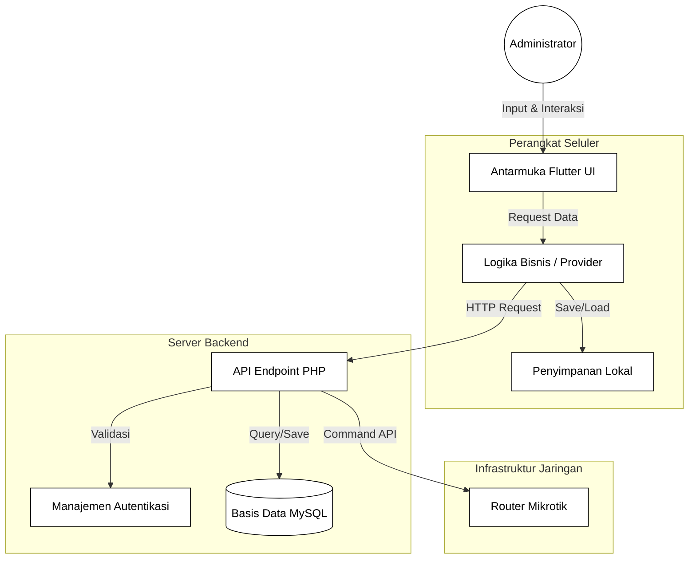

# PROPOSAL SKRIPSI

**JUDUL:** RANCANG BANGUN APLIKASI MOBILE MONITORING DAN MANAJEMEN JARINGAN MIKROTIK BERBASIS FLUTTER

---

## BAB 1

## PENDAHULUAN

### 1.1 Latar Belakang

Dalam era digital saat ini, konektivitas internet telah menjadi kebutuhan primer bagi masyarakat. Penyedia jasa layanan internet (ISP) skala kecil hingga menengah, seperti pengusaha RT/RW Net, memegang peranan penting dalam mendistribusikan akses internet hingga ke pelosok. Mayoritas penyedia layanan ini mengandalkan perangkat Mikrotik sebagai router utama untuk manajemen bandwidth, autentikasi pengguna, dan pengaturan jaringan karena kehandalan dan harganya yang terjangkau.

Namun, manajemen perangkat Mikrotik secara tradisional seringkali mengharuskan administrator untuk menggunakan perangkat komputer (PC/Laptop) dengan aplikasi Winbox atau mengakses melalui web browser. Metode ini memiliki keterbatasan, terutama dalam hal mobilitas. Masalah yang sering dihadapi administrator jaringan antara lain:

1.  **Keterbatasan Aksesibilitas:** Administrator sulit memantau kondisi jaringan secara _real-time_ ketika sedang tidak berada di depan komputer atau di lokasi server.
2.  **Responsivitas Penanganan Masalah:** Keterlambatan dalam mendeteksi dan menangani gangguan jaringan (seperti link down atau trafik penuh) karena tidak adanya notifikasi langsung ke perangkat pribadi yang selalu dibawa.
3.  **Efisiensi Operasional:** Proses manajemen pelanggan (PPPoE/Hotspot) dan pencatatan pembayaran (billing) seringkali masih dilakukan secara manual atau terpisah dari sistem monitoring, yang meningkatkan risiko kesalahan data.

Berdasarkan permasalahan tersebut, dibutuhkan sebuah solusi yang dapat memberikan fleksibilitas dan efisiensi bagi administrator jaringan. Solusi yang diusulkan adalah pembangunan aplikasi _mobile_ "Mikrotik Monitor" berbasis Flutter. Aplikasi ini dirancang untuk memungkinkan administrator memantau resource sistem, mengelola pengguna PPPoE, dan menerima notifikasi status jaringan secara _real-time_ langsung melalui _smartphone_.

### 1.2 Rumusan Masalah

Berdasarkan latar belakang di atas, rumusan masalah dalam penelitian ini adalah:

1.  Bagaimana merancang dan membangun aplikasi _mobile_ yang dapat memonitor status router Mikrotik secara _real-time_?
2.  Bagaimana mengimplementasikan fitur manajemen pengguna PPPoE (Create, Read, Update, Delete) melalui perangkat _mobile_?
3.  Bagaimana menerapkan sistem notifikasi untuk memberikan peringatan dini kepada administrator terkait kondisi jaringan?

### 1.3 Batasan Masalah

Agar penelitian ini lebih terarah, maka diberikan batasan masalah sebagai berikut:

1.  Aplikasi dibangun menggunakan framework Flutter dan dijalankan pada platform Android.
2.  Aplikasi terhubung ke router Mikrotik menggunakan API (Application Programming Interface) RouterOS.
3.  Fitur monitoring mencakup penggunaan CPU, Memory, Uptime, dan Trafik Interface.
4.  Fitur manajemen difokuskan pada layanan PPPoE dan Hotspot.
5.  Pengujian dilakukan pada perangkat Mikrotik RouterBoard (RB750r2 atau setara).

### 1.4 Tujuan Penelitian

Tujuan dari penelitian ini adalah:

1.  Menghasilkan aplikasi _mobile_ yang memudahkan administrator dalam memantau kinerja router Mikrotik kapan saja dan di mana saja.
2.  Menyediakan antarmuka yang _user-friendly_ untuk manajemen pengguna PPPoE tanpa perlu mengakses Winbox.
3.  Meningkatkan responsivitas administrator dalam menangani gangguan jaringan melalui fitur notifikasi _real-time_.

### 1.5 Manfaat Penelitian

**Bagi Penulis:**
Menerapkan ilmu yang telah dipelajari selama perkuliahan, khususnya dalam bidang pemrograman _mobile_ dan jaringan komputer.

**Bagi Administrator Jaringan:**
Meningkatkan efisiensi kerja dan kemudahan dalam pengelolaan jaringan internet, serta meminimalisir _downtime_ layanan akibat keterlambatan penanganan.

**Bagi Akademis:**
Menjadi referensi bagi penelitian selanjutnya yang berkaitan dengan pengembangan aplikasi monitoring jaringan berbasis _mobile_.

---

## BAB 2

## TINJAUAN PUSTAKA

### 2.1 Mikrotik RouterOS

Mikrotik RouterOS adalah sistem operasi berbasis kernel Linux yang digunakan untuk menjadikan komputer biasa menjadi router network yang handal. Fitur-fitur yang disediakan meliputi Firewall, Routing, Hotspot Gateway, Proxy Server, DHCP Server, dan manajemen bandwidth. RouterOS menyediakan API yang memungkinkan aplikasi eksternal untuk berkomunikasi dan melakukan konfigurasi pada router.

### 2.2 Flutter

Flutter adalah framework _open-source_ yang dikembangkan oleh Google untuk membangun aplikasi antarmuka pengguna (UI) yang indah, dikompilasi secara _native_, untuk _mobile_, web, dan desktop dari satu basis kode. Flutter menggunakan bahasa pemrograman Dart yang modern dan reaktif.

### 2.3 Mobile Monitoring

_Mobile monitoring_ adalah proses pemantauan sistem atau jaringan menggunakan perangkat bergerak (_mobile devices_). Keunggulan utama dari _mobile monitoring_ adalah mobilitas tinggi, memungkinkan pengawasan dilakukan tanpa batasan lokasi fisik selama terhubung ke internet.

### 2.4 Protokol API Mikrotik

Mikrotik menyediakan API (Application Programming Interface) yang berjalan pada port standar 8728. Protokol ini memungkinkan pertukaran data antara router dan aplikasi klien menggunakan format kalimat (_sentences_) yang terstruktur, memungkinkan eksekusi perintah CLI (_Command Line Interface_) secara remote.

---

## BAB 3

## METODOLOGI PENELITIAN

### 3.1 Metode Pengembangan Sistem

Metode pengembangan sistem yang digunakan dalam penelitian ini adalah **Waterfall**. Model ini dipilih karena pendekatannya yang sistematis dan berurutan, cocok untuk proyek dengan kebutuhan yang sudah didefinisikan dengan jelas di awal. Tahapan dalam metode Waterfall meliputi:

1.  **Analisis Kebutuhan (_Requirement Analysis_):** Mengidentifikasi kebutuhan pengguna (administrator jaringan) dan spesifikasi sistem yang diperlukan, seperti fitur monitoring trafik, manajemen user, dan notifikasi.
2.  **Desain Sistem (_System Design_):** Merancang arsitektur sistem, basis data, antarmuka pengguna (UI/UX), dan diagram UML (Use Case, Activity, Sequence, Class Diagram).
3.  **Implementasi (_Implementation_):** Penulisan kode program (_coding_) menggunakan framework Flutter dan bahasa Dart, serta integrasi dengan API Mikrotik.
4.  **Pengujian (_Testing_):** Melakukan pengujian sistem menggunakan metode _Black Box Testing_ untuk memastikan semua fitur berjalan sesuai fungsinya dan bebas dari _error_.
5.  **Pemeliharaan (_Maintenance_):** Tahap perbaikan jika ditemukan _bug_ setelah aplikasi digunakan, serta pengembangan fitur lebih lanjut.

### 3.2 Alat dan Bahan

**1. Alat**
Alat yang digunakan dalam penelitian ini adalah:

**a) Hardware**

| No  | Jenis Hardware | Spesifikasi                            |
| :-- | :------------- | :------------------------------------- |
| 1   | Laptop         | ADVAN Workplus                         |
| 2   | Processor      | AMD Ryzen 5 6600H with Radeon Graphics |
| 3   | RAM            | 16 Giga Byte                           |
| 4   | SSD            | 1 Tera Byte                            |

**b) Software**

| No  | Kategori          | Nama Perangkat Lunak | Fungsi                                         |
| :-- | :---------------- | :------------------- | :--------------------------------------------- |
| 1   | Sistem Operasi    | Windows 11           | Platform utama pengembangan                    |
| 2   | Teks Editor       | Visual Studio Code   | Teks editor utama penulisan kode program       |
| 3   | Backend Framework | Native PHP           | Pengembangan Backend dan API Wrapper           |
| 4   | Mobile Framework  | Flutter SDK          | Pengembangan aplikasi mobile                   |
| 5   | Database          | MySQL & SQLite       | DBMS untuk penyimpanan data terpusat dan lokal |
| 6   | Web Server        | Nginx                | Web Server Production                          |
| 7   | Desain UI/UX      | Figma                | Perancangan antarmuka pengguna                 |
| 8   | Diagram UML       | Draw.io              | Perancangan diagram UML                        |
| 9   | API Testing       | Postman              | Pengujian endpoint REST API                    |
| 10  | Browser           | Google Chrome        | Web browser untuk debugging aplikasi           |
| 11  | Mobile Testing    | Android 15           | Platform untuk testing aplikasi mobile         |

**2. Bahan**

Bahan penelitian yang digunakan meliputi data primer dan sekunder yang relevan dengan objek penelitian. Bahan-bahan tersebut antara lain data konfigurasi dan status _real-time_ Router Mikrotik (CPU, Memory, Traffic), data pelanggan layanan internet (PPPoE Secrets) beserta profil paket langganan, dan data transaksi pembayaran bulanan pelanggan (_Billing_). Selain itu, penelitian ini juga menggunakan dokumentasi teknis terkait topologi jaringan, referensi teknis API Mikrotik (RouterOS API) sebagai acuan protokol komunikasi, aset grafis antarmuka pengguna (ikon, ilustrasi), pustaka kode (_library_) serta dependensi Flutter, dan referensi studi literatur berupa jurnal maupun buku yang berkaitan dengan pengembangan aplikasi _mobile_ dan manajemen jaringan.

### C. Tahapan Penelitian

Tahapan penelitian dalam pengembangan aplikasi mobile berbasis Flutter untuk monitoring dan manajemen pengguna PPPoE pada MikroTik RouterOS di CMM Network Pekalongan menggunakan metode End-User Development (EUD). Metode ini dipilih karena melibatkan pengguna akhir secara langsung dalam proses pengembangan sistem sehingga aplikasi yang dihasilkan sesuai dengan kebutuhan operasional di lapangan.
Untuk memperjelas alur penelitian, tahapan penelitian ini digambarkan dalam bentuk diagram alur sebagaimana ditunjukkan pada Gambar 3.2 Tahapan Penelitian.

**Gambar 3.2 Tahapan Penelitian**

**1. Identifikasi Masalah**

Tahap identifikasi masalah merupakan langkah awal dalam penelitian ini. Berdasarkan hasil observasi di CMM Network Pekalongan, diketahui bahwa proses monitoring dan manajemen pengguna PPPoE masih mengandalkan aplikasi bawaan MikroTik seperti Winbox dan MikroTik Mobile App. Meskipun aplikasi tersebut mampu menampilkan data teknis jaringan, namun belum menyediakan informasi pelanggan secara terintegrasi, seperti identitas pelanggan, status koneksi aktif atau tidak aktif, serta data administrasi pelanggan.

Kondisi tersebut menyebabkan administrator jaringan mengalami kesulitan dalam memantau pengguna yang sedang offline secara cepat serta melakukan pengelolaan data pelanggan secara efisien. Oleh karena itu, diperlukan sebuah aplikasi mobile berbasis Flutter yang terintegrasi dengan RouterOS REST API untuk membantu proses monitoring dan manajemen pengguna PPPoE secara real-time.

**2. Pengumpulan Data**

Pengumpulan data dilakukan untuk memperoleh informasi yang relevan dan valid sebagai dasar pengembangan sistem. Metode pengumpulan data yang digunakan dalam penelitian ini meliputi:

**a. Observasi**

Observasi dilakukan secara langsung di CMM Network Pekalongan dengan mengamati proses monitoring jaringan, pengelolaan pengguna PPPoE, serta cara administrator memeriksa status koneksi pelanggan melalui RouterOS. Observasi ini bertujuan untuk memahami alur kerja yang berjalan dan kendala yang dihadapi di lapangan.

**b. Wawancara**

Wawancara dilakukan dengan administrator jaringan CMM Network Pekalongan untuk menggali kebutuhan sistem secara lebih mendalam. Wawancara ini mencakup kebutuhan fitur monitoring, data yang perlu ditampilkan dalam aplikasi, serta harapan pengguna terhadap sistem yang akan dikembangkan.

**c. Studi Literatur**

Studi literatur dilakukan dengan mempelajari buku, jurnal ilmiah, dan penelitian terdahulu yang berkaitan dengan Flutter, MikroTik RouterOS, REST API, monitoring jaringan, serta metode End-User Development. Studi ini bertujuan untuk memperkuat landasan teori dan mendukung perancangan sistem.

**3. Alur Sistem yang Diusulkan**

Alur sistem yang diusulkan menggambarkan mekanisme kerja aplikasi mobile berbasis Flutter yang terintegrasi dengan backend PHP/MySQL dan RouterOS REST API. Aplikasi mobile berfungsi sebagai antarmuka utama bagi administrator jaringan untuk mengakses data monitoring dan manajemen pengguna PPPoE.

Data monitoring jaringan diambil dari RouterOS melalui REST API, kemudian diproses oleh backend dan ditampilkan pada aplikasi mobile. Alur sistem yang diusulkan dapat dilihat pada Gambar 3.3.

Penjelasan alur diagram:

1.  **Administrator**: Pengguna yang memulai interaksi (misal: membuka aplikasi).
2.  **Perangkat Seluler**:
    - **Antarmuka UI**: Halaman visual yang dilihat pengguna.
    - **Logika Bisnis / Provider**: Otak dari aplikasi yang mengatur pertukaran data, validasi, dan state management (menggunakan library Provider di Flutter).
    - **Penyimpanan Lokal**: Menyimpan konfigurasi login agar tidak perlu input ulang.
3.  **Server Backend**: Perantara yang aman antara aplikasi mobile dan router.
4.  **Infrastruktur Jaringan (Mikrotik)**: Target akhir yang dimonitor. Diletakkan di paling bawah karena menerima perintah/request dari sistem di atasnya.

**Gambar 3.3 Alur Sistem yang Diusulkan**

**4. Metode Pengembangan Sistem**

Metode pengembangan sistem yang digunakan dalam penelitian ini adalah End-User Development (EUD). Metode ini memungkinkan pengguna akhir terlibat secara langsung dalam proses pengembangan aplikasi. Tahapan metode EUD yang diterapkan adalah sebagai berikut:

**a. Scope**

Tahap scope bertujuan untuk menentukan ruang lingkup pengembangan aplikasi berdasarkan permasalahan yang telah diidentifikasi. Ruang lingkup sistem difokuskan pada monitoring pengguna PPPoE, penampilan status router, serta pengelolaan data pelanggan dalam satu platform terintegrasi.

**b. Requirements**

Tahap requirements dilakukan untuk menentukan kebutuhan fungsional dan non-fungsional sistem. Kebutuhan fungsional meliputi fitur monitoring pengguna PPPoE aktif dan tidak aktif, informasi resource router, pengelolaan data pelanggan, serta dashboard monitoring. Kebutuhan non-fungsional mencakup kemudahan penggunaan, responsivitas aplikasi, dan keamanan akses sistem.

**c. Development (Coding)**

Tahap development merupakan proses implementasi sistem berdasarkan kebutuhan yang telah ditentukan. Aplikasi mobile dikembangkan menggunakan framework Flutter, sedangkan backend dikembangkan menggunakan Native PHP dengan database MySQL. Integrasi dengan RouterOS dilakukan melalui REST API untuk mengambil data monitoring jaringan secara real-time. Pada tahap ini, fitur yang dikembangkan dievaluasi secara langsung oleh pengguna akhir.

**d. Evaluation**

Tahap evaluation dilakukan untuk mengevaluasi sistem yang telah dikembangkan. Administrator jaringan menguji aplikasi secara langsung untuk memastikan seluruh fitur berjalan sesuai kebutuhan. Hasil evaluasi digunakan sebagai dasar untuk penyempurnaan sistem.

**5. Pengujian Sistem**

Pengujian sistem dilakukan untuk memastikan aplikasi berfungsi sesuai dengan kebutuhan yang telah ditetapkan. Metode pengujian yang digunakan adalah Black Box Testing, yaitu metode pengujian yang berfokus pada fungsi input dan output sistem tanpa memperhatikan struktur kode program. Pengujian meliputi fungsi login, monitoring pengguna PPPoE, pengelolaan data pelanggan, serta tampilan informasi router.

**6. Evaluasi dan Penyempurnaan**

Tahap evaluasi dan penyempurnaan dilakukan berdasarkan hasil pengujian sistem dan masukan dari pengguna akhir. Perbaikan dilakukan apabila ditemukan kesalahan, kekurangan, atau ketidaksesuaian fungsi sistem. Tahap ini bertujuan untuk memastikan aplikasi siap digunakan dan mampu mendukung proses monitoring serta manajemen pengguna PPPoE di CMM Network Pekalongan secara efektif dan efisien.
